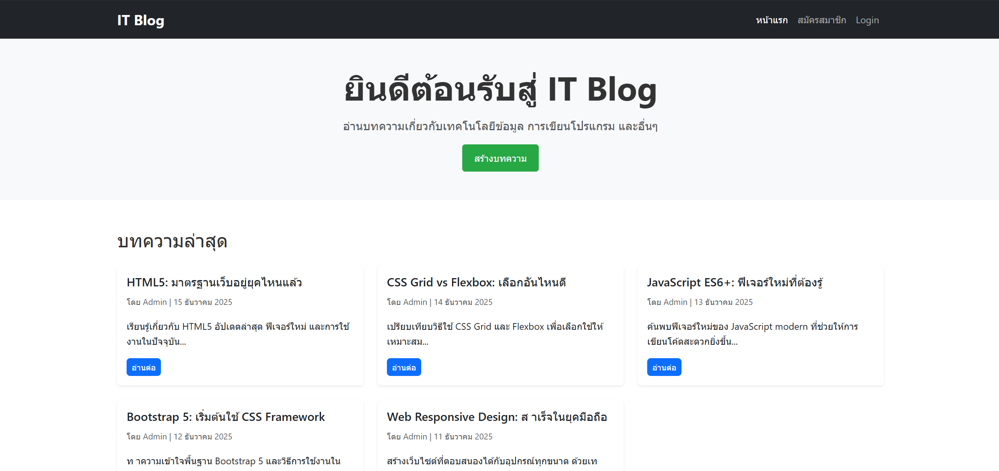
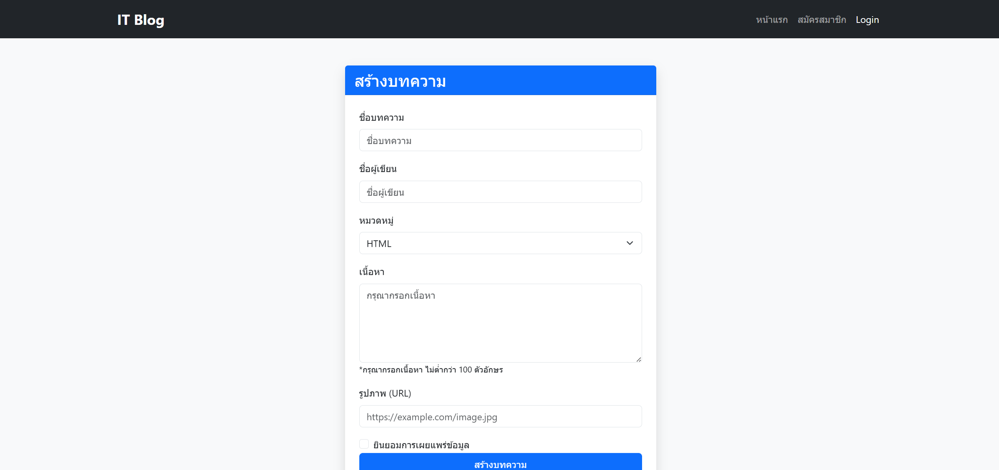

# IT Blog - Lab04 Bootstrap

เว็บไซต์บล็อกด้าน IT สร้างด้วย **Bootstrap 5** สำหรับเรียนรู้การใช้งาน CSS Framework

## คุณสมบัติ

- ✅ หน้าแรกแสดงรายการบทความ
- ✅ หน้าสร้างบทความใหม่
- ✅ หน้าอ่านบทความ
- ✅ ระบบ Login / Register
- ✅ Responsive Design รองรับทุกขนาดหน้าจอ

## โครงสร้างโปรเจค

```
lab04-bootstrap/
├── index.html          # หน้าแรก แสดงรายการบทความ
├── create-blog.html    # หน้าสร้างบทความใหม่
├── blog-post.html      # หน้าแสดงเนื้อหาบทความ
├── login.html          # หน้า Login
├── register.html       # หน้าสมัครสมาชิก
├── lab04-bootstrap.md  # เอกสารอธิบายการใช้ Bootstrap
├── css/
│   └── style.css       # Custom CSS เพิ่มเติม
├── js/
│   └── script.js       # JavaScript
└── images/
    ├── index.png       # ภาพตัวอย่างหน้าแรก
    └── create-box.png  # ภาพตัวอย่างหน้าสร้างบทความ
```

## ตัวอย่างหน้าเว็บ

### หน้าแรก (Index)


### หน้าสร้างบทความ (Create Blog)


## เทคโนโลยีที่ใช้

- HTML5
- CSS3
- Bootstrap 5.3
- JavaScript

## วิธีใช้งาน

1. Clone หรือ Download โปรเจค
2. เปิดไฟล์ `index.html` ในเบราว์เซอร์
